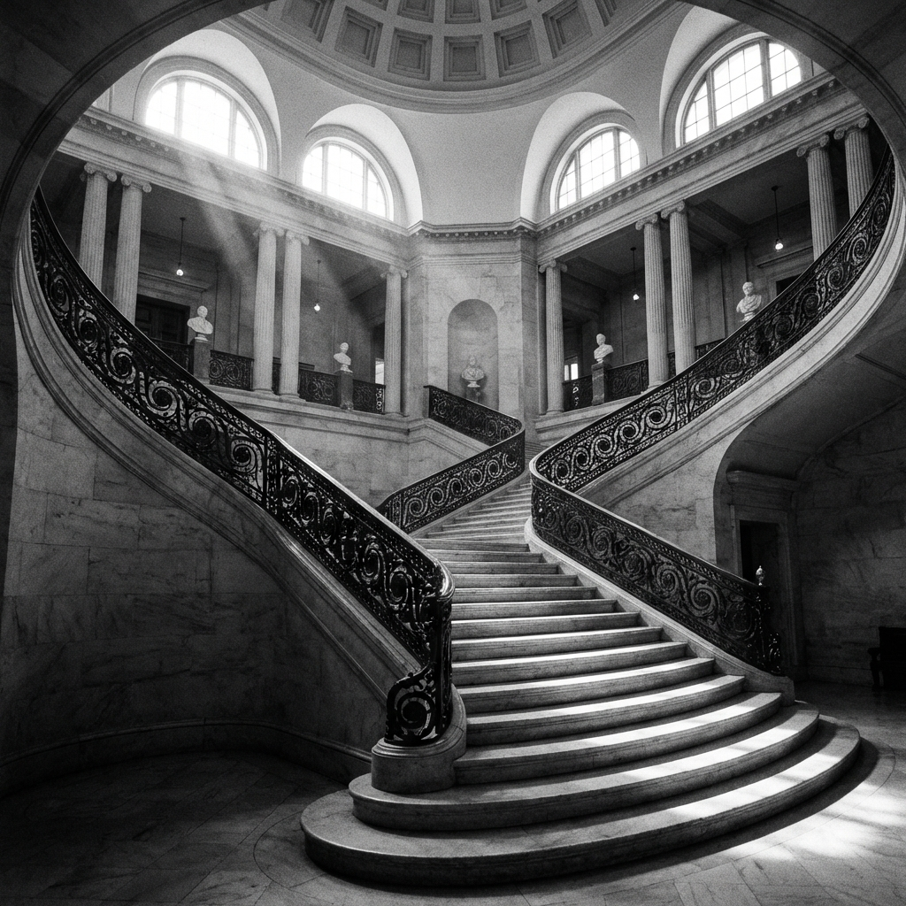

# ATELIER VIREN

> Intervenciones contemporáneas sobre arquitectura histórica

Sitio web institucional para estudio de restauración y conservación del patrimonio arquitectónico. Proyecto prototipo que demuestra capacidades de diseño de sistemas, arquitectura frontend, y generación de contenido profesional.



## 🏛️ Características

- **Sistema de diseño ARCHÓN** — Jerarquía tipográfica editorial (Serif/Sans/Mono)
- **Estética institucional** — Tono académico/museístico sin elementos comerciales
- **6 secciones home** — Hero, Sobre Nosotros, Proyectos, Áreas, Filosofía, Contacto
- **3 proyectos completos** — Monasterio de San Bernardo, Casa Colonial Álvarez, Palacio Municipal
- **21 imágenes documentales** — Fotografía arquitectónica B&N generadas con IA
- **Smooth scrolling** — Lenis (1.4s glacial) para navegación fluida
- **Side navigation** — Dot navigation con active tracking
- **Responsive** — Optimizado para mobile/tablet/desktop

## 🛠️ Stack Tecnológico

- **Framework:** [Astro](https://astro.build) 5.1.5
- **Runtime:** [Bun](https://bun.sh) 1.3.0
- **Lenguaje:** TypeScript
- **Styling:** Vanilla CSS + Tailwind v4
- **Smooth Scroll:** [@studio-freight/lenis](https://lenis.darkroom.engineering/)
- **Fonts:** Libre Baskerville, Inter, JetBrains Mono (vía Fontsource)

## 📦 Instalación

```bash
# Clonar repositorio
git clone <repo-url>
cd atelier-arq-agency

# Instalar dependencias (requiere Bun)
bun install

# Desarrollo
bun dev

# Build para producción
bun run build

# Preview de build
bun preview
```

## 📂 Estructura del Proyecto

```
src/
├── components/         # Componentes globales
│   ├── Footer.astro
│   ├── SideNav.astro
│   ├── SmoothScroll.astro
│   └── DesignSystemBadge.astro
├── layouts/
│   └── Layout.astro
├── modules/
│   ├── home/          # Secciones homepage
│   └── proyecto/      # Componentes proyectos
├── pages/
│   ├── index.astro
│   ├── design-system.astro
│   └── proyecto/      # Páginas proyectos
└── styles/
    └── global.css     # Sistema ARCHÓN

public/images/         # Imágenes estáticas
├── monasterio/        # 8 imágenes
├── casa-colonial/     # 5 imágenes
└── palacio/          # 8 imágenes
```

## 🎨 Sistema de Diseño ARCHÓN

### Paleta de Colores

```css
--color-stone-light: #e7e5e1 /* Background */ --color-stone-dark: #2f2f2d
  /* Foreground */ --color-iron-gray: #6b6e6a /* Muted */
  --color-oxide-accent: #8c4a32 /* Accent */;
```

### Jerarquía Tipográfica

- **Serif** (Libre Baskerville) — Títulos, texto largo
- **Sans** (Inter) — UI, subtítulos
- **Mono** (JetBrains Mono) — Metadata técnica

### Spacing (Base 8px)

```
xs: 16px  |  sm: 24px  |  md: 32px
lg: 48px  |  xl: 64px  |  2xl: 96px  |  3xl: 128px
```

## 🚀 Features Destacados

### Hero con Background Arquitectónico

Hero full-screen con imagen de escalera monumental (Palacio Municipal) + overlay oscuro (85-90%) para legibilidad máxima.

### Navegación Lateral Inteligente

- Dot indicators minimalistas
- Active section tracking (Intersection Observer)
- Labels on-hover
- Smooth scroll integrado con Lenis
- Adaptación de color (blanco en Hero/oscuro en demás)

### Componentes Modulares

Sistema de 5 componentes reutilizables para proyectos:

- `ProjectHero` — Hero con metadata
- `TechnicalData` — Ficha técnica 2 columnas
- `MemoriaDescriptiva` — Documentación académica
- `ProjectGallery` — Grid asimétrico museo
- `ProjectNavigation` — Prev/Next circular

### Smooth Scrolling Premium

Lenis configurado con easing "glacial" (1.4s, ExpoOut) para navegación cinematográfica sin mareo.

## 📊 Métricas

- **Páginas:** 5 (home + 3 proyectos + design-system)
- **Componentes:** 13 modulares
- **Contenido:** ~6900 palabras memoria descriptiva
- **Imágenes:** 21 documentales B&N
- **Líneas de código:** ~3500+

## 🎯 Propósito

Proyecto **prototipo/demostración** para agencia de desarrollo web, mostrando:

1. Diseño de sistemas coherentes
2. Arquitectura frontend escalable
3. Generación de contenido profesional
4. Atención al detalle (UX/UI)
5. Capacidad de implementación completa

**NO es un sitio real** — es un case study ficticio del estudio "ATELIER VIREN".

## 📝 Licencia

[MIT](LICENSE) — Proyecto de portfolio/demostración.

## 👨‍💻 Autor

Proyecto desarrollado para demostración de capacidades técnicas y de diseño.

---

**Nota:** Las imágenes arquitectónicas fueron generadas con IA para propósitos demostrativos. Los proyectos descritos (Monasterio de San Bernardo, Casa Colonial Álvarez, Palacio Municipal) son ficticios.
